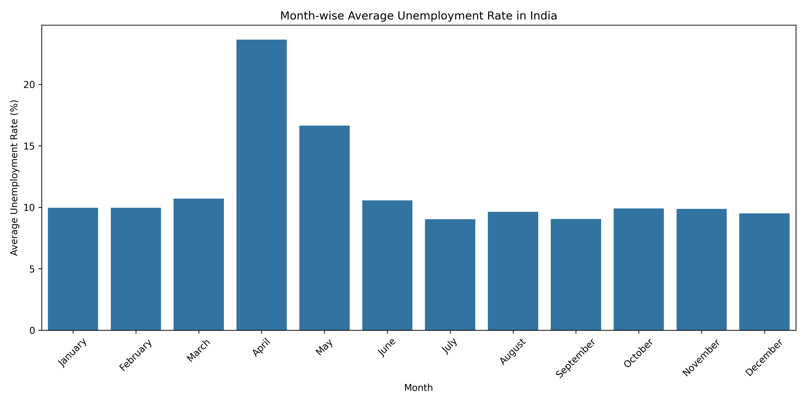
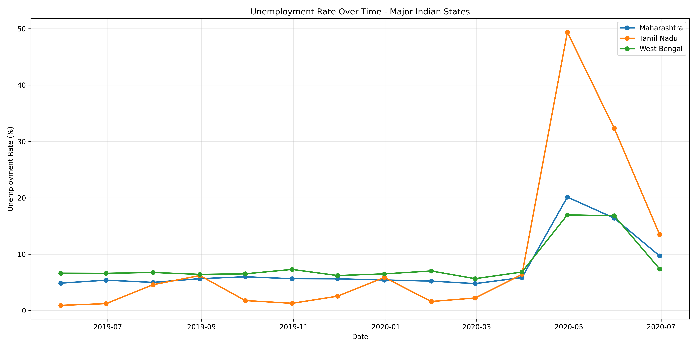
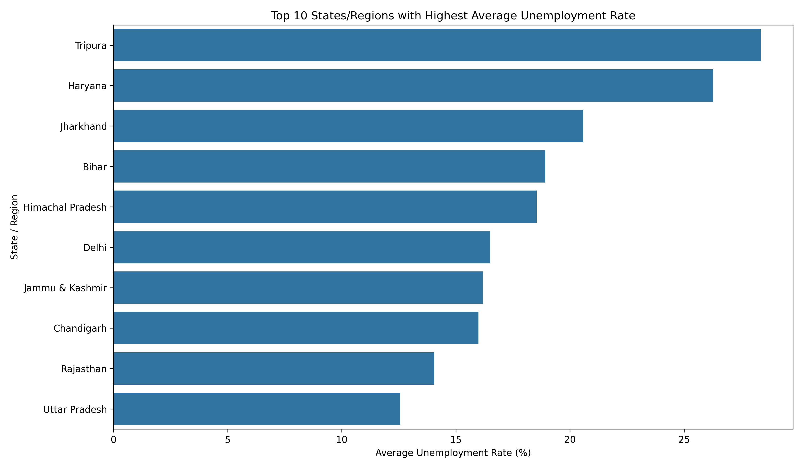
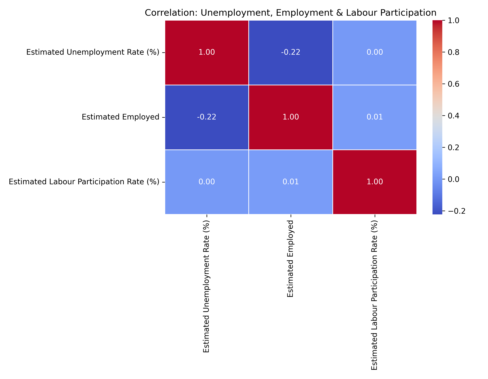
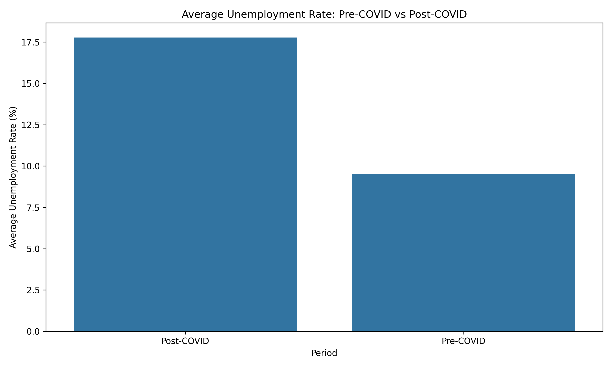
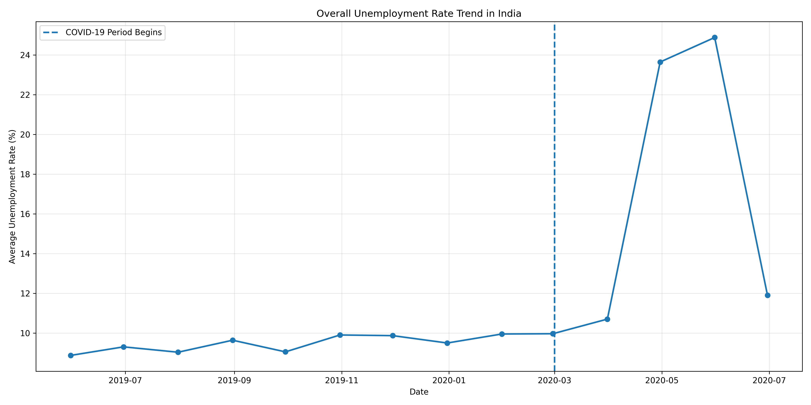

# 📊 Unemployment Analysis with Python

## 🎯 Project Objective

The objective of this project is to perform **Exploratory Data Analysis (EDA)** on unemployment data from India to identify regional and temporal trends.

The analysis focuses particularly on the impact of the **COVID-19 pandemic** on unemployment rates by comparing unemployment conditions before and after the beginning of the COVID-19 period.

The project analyzes:

* Regional unemployment patterns
* Monthly unemployment trends
* Unemployment rates over time
* States/regions with the highest average unemployment
* Relationship between unemployment, employment and labour participation
* Pre-COVID vs Post-COVID unemployment rates

---

## 🛠️ Technologies Used

* **Python**
* **Pandas**
* **NumPy**
* **Matplotlib**
* **Seaborn**
* **VS Code**

---

## 📂 Dataset

The project uses the **Unemployment in India** dataset.

The dataset contains unemployment-related information for different Indian states/regions and areas.

### Dataset Columns

| Column                                  | Description                         |
| --------------------------------------- | ----------------------------------- |
| Region                                  | Name of the Indian state/region     |
| Date                                    | Date of observation                 |
| Frequency                               | Frequency of the observation        |
| Estimated Unemployment Rate (%)         | Estimated unemployment rate         |
| Estimated Employed                      | Estimated number of employed people |
| Estimated Labour Participation Rate (%) | Labour participation rate           |
| Area                                    | Rural or Urban area                 |

---

## 📊 Dataset Information

### Original Dataset

```text
Rows: 768
Columns: 7
```

### After Data Cleaning

```text
Rows: 740
Columns: 7
```

The original dataset contained **28 records with missing values**. These incomplete records were removed during preprocessing.

The dataset also contained duplicate rows, which were identified during the initial inspection.

---

## 🧹 Data Cleaning & Preprocessing

The following preprocessing steps were performed:

1. Loaded the CSV dataset using Pandas.
2. Removed extra spaces from column names.
3. Removed unnecessary spaces from text values.
4. Converted the `Date` column from object/string format to datetime format.
5. Converted numerical columns into appropriate numeric data types.
6. Checked for missing values.
7. Removed records with missing values in important columns.
8. Sorted the dataset chronologically.
9. Reset the DataFrame index.
10. Created additional month and COVID-period columns for analysis.

---

## 🔍 Exploratory Data Analysis

The project performs several EDA operations to understand unemployment patterns in India.

### EDA Includes

* Dataset shape inspection
* Data type inspection
* Missing-value analysis
* Duplicate-value analysis
* Descriptive statistics
* Region-wise average unemployment
* Month-wise unemployment trends
* State-wise comparison
* Time-series analysis
* Correlation analysis
* COVID-19 impact analysis

---

# 🖼️ Visualizations Preview

The following visualizations were generated during the analysis:

### 📅 1. Month-wise Average Unemployment Rate



Shows the average unemployment rate for each month and highlights the sharp increase during the COVID-19 period.

---

### 📈 2. State-wise Unemployment Time Series



Compares unemployment-rate trends over time for Maharashtra, Tamil Nadu, and West Bengal.

---

### 🏆 3. Top 10 States/Regions by Average Unemployment



Displays the ten states/regions with the highest average unemployment rates.

---

### 🔥 4. Correlation Heatmap



Shows the correlation between unemployment rate, estimated employment, and labour participation rate.

---

### 🦠 5. Pre-COVID vs Post-COVID Comparison



Compares the average unemployment rate before and after the beginning of the COVID-19 period.

**Pre-COVID:** 9.51%
**Post-COVID:** 17.77%

---

### 📊 6. Overall Unemployment Trend



Shows the overall unemployment-rate trend across the complete study period and highlights the COVID-19 period.

---

## 📌 Visualization Summary

| Visualization           | Purpose                                     |
| ----------------------- | ------------------------------------------- |
| Month-wise Unemployment | Analyze monthly patterns                    |
| State-wise Time Series  | Compare regional trends                     |
| Top 10 States           | Identify high-unemployment regions          |
| Correlation Heatmap     | Analyze relationships between variables     |
| Pre vs Post COVID       | Measure COVID-19 impact                     |
| Overall Trend           | Understand the complete time-series pattern |


# 📁 Project Structure

```text
Unemployment Analysis with Python/
│
├── data/
│   └── Unemployment in India.csv
│
├── outputs/
│   ├── 01_month_wise_unemployment.png
│   ├── 02_state_time_series.png
│   ├── 03_top_10_states.png
│   ├── 04_correlation_heatmap.png
│   ├── 05_pre_vs_post_covid.png
│   ├── 06_overall_unemployment_trend.png
│   ├── cleaned_unemployment_data.csv
│   ├── covid_comparison.csv
│   ├── observations.txt
│   └── region_average_unemployment.csv
│
├── src/
│   └── unemployment_analysis.py
│
├── requirements.txt
└── README.md
```

---

# ⚙️ Installation

Make sure Python is installed on your system.

Open the project folder in **VS Code** and open the terminal.

Install the required libraries:

```bash
pip install -r requirements.txt
```

Or install them individually:

```bash
pip install numpy pandas matplotlib seaborn
```

---

# ▶️ How to Run the Project

From the project root directory, run:

```bash
python src/unemployment_analysis.py
```

The program automatically performs:

```text
Load Dataset
      ↓
Data Inspection
      ↓
Data Cleaning
      ↓
Descriptive Statistics
      ↓
Regional Analysis
      ↓
Monthly Analysis
      ↓
Time-Series Analysis
      ↓
Top 10 State Analysis
      ↓
Correlation Analysis
      ↓
COVID-19 Comparison
      ↓
Generate Visualizations
      ↓
Save Results
```

---

# 📄 Generated Files

The program automatically creates the following files inside the `outputs` folder.

### Visualizations

```text
01_month_wise_unemployment.png
02_state_time_series.png
03_top_10_states.png
04_correlation_heatmap.png
05_pre_vs_post_covid.png
06_overall_unemployment_trend.png
```

### Analysis Results

```text
cleaned_unemployment_data.csv
covid_comparison.csv
region_average_unemployment.csv
observations.txt
```

---

# 📌 Key Findings

### Regional Findings

* **Tripura** had the highest average unemployment rate at **28.35%**.
* **Haryana** ranked second at **26.28%**.
* **Jharkhand** ranked third at **20.58%**.
* Considerable differences were observed between Indian states and regions.

### Temporal Findings

* Average unemployment was relatively lower during most months.
* **April recorded the highest monthly average at 23.64%**.
* July recorded the lowest monthly average at **9.03%**.

### COVID-19 Findings

The most significant finding of the analysis is the difference between pre-COVID and post-COVID unemployment:

```text
Pre-COVID  = 9.51%
Post-COVID = 17.77%
Increase   = 8.26 percentage points
```

This highlights the significant disruption in employment conditions during the COVID-19 period.

### Correlation Findings

* Unemployment and estimated employment show a weak negative correlation.
* Unemployment and labour participation show a very weak relationship in this dataset.
* Correlation should not be interpreted as causation.

---

# 🎓 Learning Outcomes

This project helped demonstrate practical knowledge of:

* Python data analysis
* Pandas DataFrames
* Data cleaning
* Missing-value handling
* Date/time conversion
* Exploratory Data Analysis
* GroupBy operations
* Statistical analysis
* Time-series analysis
* Data visualization
* Matplotlib
* Seaborn
* Correlation analysis
* COVID-19 impact analysis
* Exporting processed datasets and results

---

# 🏆 Conclusion

The **Unemployment Analysis with Python** project successfully explores unemployment patterns across India using historical unemployment data.

The analysis identified significant regional differences in unemployment rates and revealed clear temporal variations.

The most important result is the increase in average unemployment from **9.51% before the COVID-19 period to 17.77% from March 2020 onward**, representing an increase of approximately **8.26 percentage points**.

The project demonstrates how Python-based Exploratory Data Analysis can be used to transform raw unemployment data into meaningful insights through statistical analysis and visualization.

---

# 🚀 Future Improvements

The project can be extended by:

* Adding interactive dashboards using Power BI or Plotly
* Performing state-level COVID impact analysis
* Building unemployment forecasting models
* Adding urban vs rural comparisons
* Analyzing employment growth over time
* Applying statistical hypothesis testing
* Creating an interactive web dashboard using Streamlit

---

# 👨‍💻 Author

**Sarthak Bhangade**

B.Tech – Artificial Intelligence & Data Science
**Sanjivani University**
2024–2028

---
